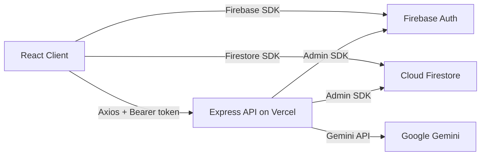

# Solace

**Your AI companion through the pressure of exams.**

[](https://solace-app.vercel.app)
[](https://ai.google.dev)

---

## The Problem

Indian students preparing for competitive exams like NEET, JEE, CUET, CAT, GATE, and UPSC face extreme stress, burnout, and isolation. There is no accessible, personalized support tool that understands their specific academic context and provides meaningful mental wellness support throughout their exam journey.

## The Solution

Solace is a premium, AI-powered mental wellness tracker that analyzes open-ended journal entries and mood logs using the Gemini API to surface hidden stress patterns and deliver hyper-personalized coping strategies, adaptive mindfulness exercises, and empathetic conversational support — 24/7, through the entire exam journey.

---

## Screenshots


---

## Tech Stack

| Layer | Technology |
|-------|-----------|
| Frontend | React 18, Vite, Tailwind CSS |
| Animations | GSAP 3, Lenis |
| Icons | Lucide React |
| Charts | Recharts |
| Backend | Express.js (Vercel Serverless) |
| Auth | Firebase Authentication |
| Database | Cloud Firestore |
| AI | Gemini 1.5 Pro / Flash |
| Deployment | Vercel (frontend + backend) |

---

## Demo Credentials

```
Email:    demo@solace.app
Password: Demo@2025
```

This account is pre-populated with sample journal entries, mood logs, and chat sessions so the app is not empty during evaluation.

---

## Architecture



---

## Local Setup

### Prerequisites

- Node.js 18+
- A Firebase project with Authentication and Firestore enabled
- A Gemini API key from [Google AI Studio](https://aistudio.google.com)

### Steps

```bash
# 1. Clone the repository
git clone https://github.com/your-username/solace.git
cd solace

# 2. Install client dependencies
cd client
npm install

# 3. Install server dependencies
cd ../server
npm install

# 4. Configure environment variables
# Copy .env.example files and fill in your credentials
cp client/.env.example client/.env
cp server/.env.example server/.env

# 5. Start the development servers
# Terminal 1 — Client
cd client
npm run dev

# Terminal 2 — Server
cd server
npm run dev
```

---

## Firebase Setup

1. Create a Firebase project at [console.firebase.google.com](https://console.firebase.google.com)
2. Enable **Email/Password** and **Google** sign-in providers under Authentication
3. Create a **Cloud Firestore** database
4. Add authorized domains: `localhost`, `solace-app.vercel.app`, `solace-server.vercel.app`
5. Deploy Firestore security rules before first use:

```
rules_version = '2';
service cloud.firestore {
  match /databases/{database}/documents {
    match /users/{userId} {
      allow read, write: if request.auth != null
                         && request.auth.uid == userId;

      match /{subcollection}/{docId} {
        allow read, write: if request.auth != null
                           && request.auth.uid == userId;
      }
    }
  }
}
```

6. Create the demo user (`demo@solace.app` / `Demo@2025`) in Firebase Auth
7. Pre-populate demo user data in Firestore (5 journals, 14 mood logs, 1 chat session)

---

## Deployment

This project deploys as two separate Vercel projects:

- **solace-app**: Root Directory `client/`, Framework: Vite
- **solace-server**: Root Directory `server/`, Framework: Other (Node.js)

Add all environment variables to each project's Vercel environment settings.

---

## Live Demo

[https://solace-app.vercel.app](https://solace-yvwr.vercel.app/)

---

## License

Built for the Google Hackathon — Mental Wellness Tracker Challenge.
